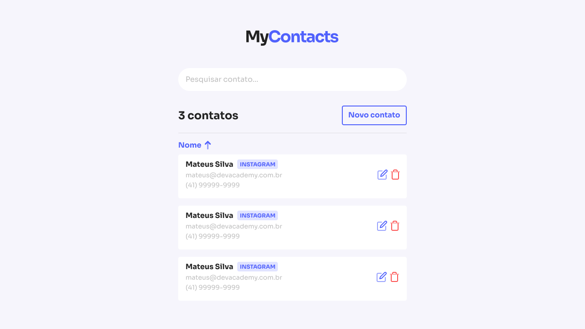

<div align="center">
  
  <p>
    Front-end da aplicação MyContacts criada, principalmente, com ReactJS e NodeJS, com o objetivo de proporcionar um ambiente para controle de contatos e seus respectivos dados.
    <br>
    <a href="https://github.com/Gabrielhsm20/mycontacts-api" target="_blank">
      Visualize o back-end
    </a>
  </p>
</div>
<div align="center" style="margin: 20px 0">
  
  
  <a href="https://github.com/Gabrielhsm20/mycontacts/commits/master" target="_blank">
    
  </a>
  <a href="https://github.com/Gabrielhsm20/mycontacts/issues" target="_blank">
    
  </a>
</div>

## 💻 Mockup
<div align="center">
  
  <a href="https://www.figma.com/file/zhAwjW2RimyjccDgiY6luz/MyContacts" target="_blank">
    Mockup completo
  </a>
</div>

## 💡 Projeto

A aplicação MyContacts é um dos projetos propostos e iniciados no curso <a href="https://jstack.com.br/" target="_blank">JStack</a> ministrado pelo <a href="https://github.com/maateusilva" target="_blank">Mateus Silva</a>, e tem como objetivo disponibilizar um ambiente para controle de contatos e seus respectivos dados.

## 🛠 Ferramentas

- [Node.js](https://nodejs.org/en/docs/)
- [React](https://reactjs.org/)
- [React Router V5](https://reactrouter.com/docs/en/v6/upgrading/v5)
- [Styled Components](https://styled-components.com/)

## 🚀 Instalação
```bash
$ git clone https://github.com/Gabrielhsm20/mycontacts.git
$ cd mycontacts
$ npm install
$ npm start
```
